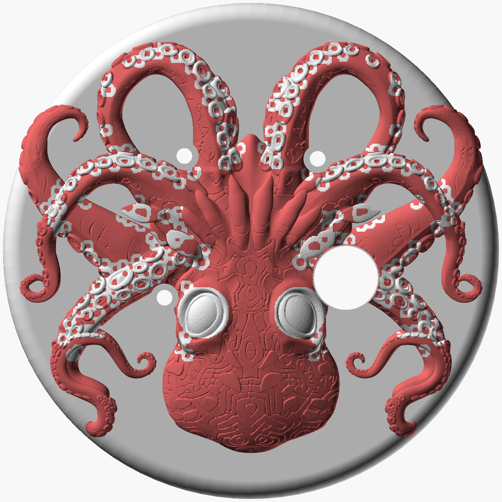
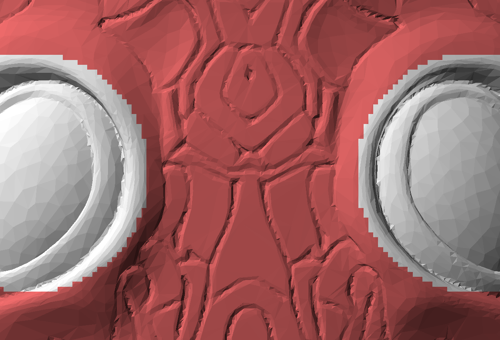
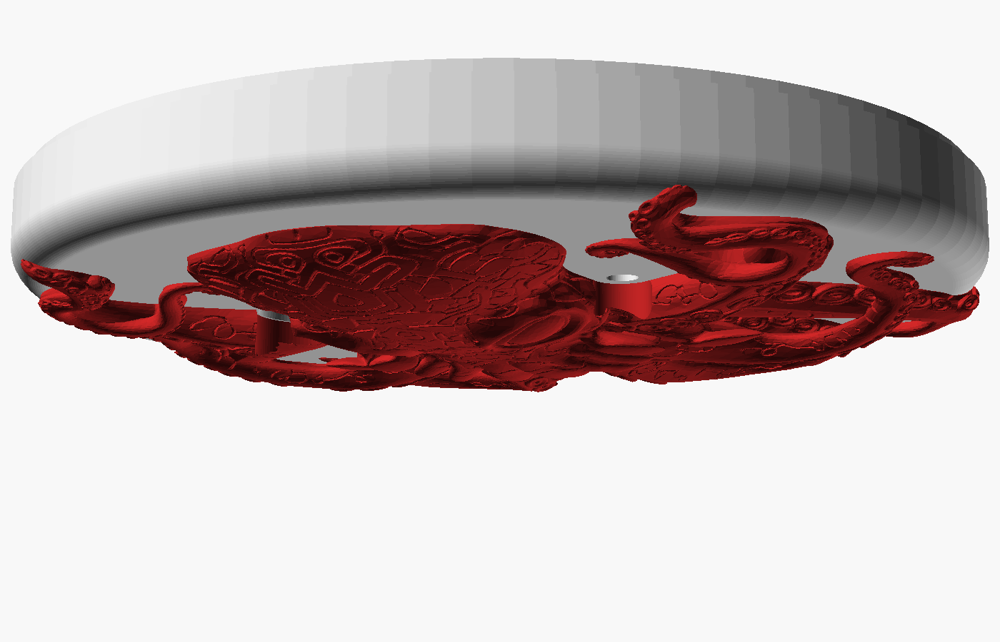

# Kraken Medallion — pendant enclosure (rev v8)

A 70mm disc medallion worn on the chest, hosting the XIAO ESP32S3 Sense,
an LP603449 cell, three INMP441 mics and the camera, under a bas-relief
kraken whose arms wrap over the rim.

| | |
|---|---|
| Case | Ø70.0 × 24.3mm (front 6.5 + back 17.8) |
| With relief | 29.12mm thick, Ø71.67mm across the arm tips |
| Interior | 20.7mm against a 20.2mm stack — margin +0.5mm |
| Fasteners | 4 × M2 cap head into brass heat-set inserts, 90° bolt circle r=29 |
| Adhesive | E7000 (owner's choice — worth 0.7mm of Z over foam tape) |
| Wiring | every joint hand-soldered; no pin headers anywhere |
| Relief | two materials — body in the kraken colour, eyes + sucker rings in the shell colour |



## Files

| File | What it is |
|---|---|
| `pendant_case_v8.scad` | the design of record; `part=` selects `front`/`back`/`kraken_body`/`kraken_accents` |
| `build_kraken.py` | regenerates the relief from the source Meshy 3MF |
| `split_materials.py` | splits that relief into body + accents for two-material printing |
| `kraken_body.stl` | the sculpt — **kraken filament** |
| `kraken_accents.stl` | eyes + sucker rings — **shell filament** |
| `kraken_wrap_bored.stl` | the un-split relief; input to the splitter, and the single-material fallback |
| `front_shell.stl`, `back_shell.stl` | rendered shells, both `Simple: yes`, `Volumes: 2` |
| `pendant_case_v7.scad` | previous revision, single-material relief |

```
openscad -o front_shell.stl -D 'part="front"' pendant_case_v8.scad
openscad -o back_shell.stl  -D 'part="back"'  pendant_case_v8.scad
python3 build_kraken.py <Meshy_AI_Crimson_Kraken.3mf>   # -> kraken_wrap_bored.stl
python3 split_materials.py                              # -> body + accents
```

## v8 — the eyes and sucker rings print in the shell material

They read as the case showing through the creature. The relief is therefore
two complementary solids, **4.537 + 0.475 = 5.013 cm³** — exactly the whole
relief, so the slicer treats them as one object with two materials rather
than two parts you have to align. Body is a single solid; accents come out
as 41 islands (the two eyes plus the ring runs along each arm).

**This needs an MMU/AMS or a toolchanger.** The accents sit at ~100 different
heights scattered across the sculpt, so there is no single Z at which a
manual filament swap could produce them.

Meshy exports carry no per-feature tags, so both features are found from the
geometry (`split_materials.py`):

- **sucker rings** — a ring matched filter over five radii (0.62–1.15mm)
  locates each sucker; a mask-normalised Gaussian high-pass then supplies the
  exact ring *shape*, so obliquely-viewed elliptical rings come out right.
  The filter is only a gate: it says where, not what. An analytic annulus at
  the detected radius is unioned in to *close* the many rings the high-pass
  only catches an arc of — on its own the high-pass looks scrappy, and the
  annulus alone looks mechanical.
- **eyes** — fitted directly: brute-force the best rim circle over the left
  eye, then mirror about the sculpt's symmetry axis at x=35. Lands at
  (28.20, 43.60) and (41.80, 43.60), rim radius 3.30mm.

Two details worth knowing if you retune it:

- **Mask-normalised smoothing is not optional.** A plain Gaussian bleeds
  across the silhouette, which makes every arm edge look raised and puts the
  detections on the arm outlines instead of the suckers.
- **The beak is excluded by an explicit ellipse, deliberately.** The mouth's
  radiating spikes are smooth and carry no suckers — confirmed against the
  height field — but the *groove between* two adjacent spikes is genuinely
  dish-shaped with raised flanks, which is a sucker as far as any local
  detector is concerned. Five discriminators were tried on it: component
  elongation, ring closure, rim-vs-centre on height rather than residual,
  angular isotropy, and simply raising the matched-filter threshold. Every
  one removed real suckers faster than it removed the grooves.

Accents reach 1.2mm below the local surface and stop 0.30mm above the glue
plane, so every one is backed by body material — none is a loose insert.
Accents also stop at r=32.3mm: past that the arms roll over the rim, where a
top-down height field no longer describes the surface. The colour boundary is
quantised to the 0.15mm raster, which is well under what a 0.4mm nozzle
resolves.



## The three things v7 changed, and why

### 1. The arms wrap the rim

The supplied sculpt is a flat-backed relief with **no geometry below its
own back plane**, so scaling it until the arms reach the edge does not make
them grip the edge — it makes them overhang into air. `build_kraken.py`
therefore bends the mesh: each vertex becomes (footprint, height above the
back plane), the footprint is re-projected onto the case's real outer
surface — flat disc → 2.5mm rim fillet → the r=35 cylinder — and the height
is re-applied along that surface's local normal.

The arms now run 1.95mm down the side and stand 0.83mm proud of the rim.
They stop 4.55mm short of the parting plane, so the shells still separate.

**The rim fillet is structural, not decorative.** `rim_fillet_r` in the SCAD
and `RF` in the build script are the same number twice; if they disagree the
relief's back face cuts through the shell's corner.

Scale was solved, not chosen. Swept against the full opening solve:

| XY scale | face coverage | wrap depth | openings that fit |
|---|---|---|---|
| ×1.28 | 56.3% | 5.50mm | 2 of 4 |
| ×1.22 | 52.9% | 3.85mm | 2 of 4 |
| **×1.16** | **47.9%** | **1.95mm** | **4 of 4** ← taken |

×1.28 is the more dramatic object, but it buries two of the three mic ports.
×1.16 is the largest that keeps the pendant functional. The wrap costs
**zero** thickness: 29.12mm, same as v6.

### 2. The camera looks through the artwork — and that is forced

v5 and v6 rasterised the sculpt's silhouette and then morphologically
*opened* the mask by 2 cells, which deleted every tendril thinner than
1.6mm. Tendrils are exactly what lay over the camera. Measured against real
vertices rather than the smoothed mask, **v6's camera was buried 1.90mm
under artwork** — it would not have seen anything.

Re-swept with an honest mask, there is **no** lens position anywhere in the
board's reach window with the 4.5mm of clear sculpt an aperture needs; the
best available anywhere is 3.6mm, at either scale. So the aperture is bored
through the relief as well:

- 9.4mm bore, 3.27mm deep, + 1.8mm shell wall = **4.89mm tunnel** for a
  9.0mm aperture — 0.54:1, no vignetting (an OV2640's 65° cone needs
  better than 1.6:1)
- bore depth barely varies across the reach window (3.09mm best, 3.37mm
  worst), so the spot was chosen for **board slack** instead: ±2.0mm of
  travel in every direction before the stock FPC is stressed. No extension
  cable.

The three mic ports get a 4.0mm relief bore too. They already cleared the
artwork — but only by 0.07–0.23mm, which is inside hand-alignment error and
close enough for E7000 squeeze-out to bridge a 2.2mm port. The bores remove
only the grazing tendril edges (3–5mm³ each) and take every port to 0.90mm
of clear air. All four bores together remove 2.9% of the sculpt.

### 3. Printing the relief now needs support

The relief's back is no longer a plane — the outer ~3.3mm annulus curls down
1.95mm to grip the rim, and 22.6% of the skirt's faces are steeper than 45°.
Sat sculpt-up it rests on the arm tips with the glue face 1.95mm in the air.

- **FDM** — print sculpt-up, paint supports on the outer annulus only and
  block them everywhere else. That annulus is 716mm² and only ~17% of it
  carries sculpt, so it is a few tenths of a cm³ of support. Every contact
  scar lands on the glue face or on the skirt's inner surface — both hidden
  once bonded, and E7000 is gap-filling enough not to care.
- **Resin / SLS / MJF** — free. This is the better part to send out.

The shells are unaffected: front prints art-face-down, back prints
rim-down, neither needs support.



## Layout

All four bosses sit on a true 90° bolt circle at r=29, outside the battery
pocket, nearest opening 13.18mm. Sensors are solved around them against the
sculpt's true silhouette, with wall clearance as a hard constraint rather
than a scoring term — v5 put a mic 1.06mm from the wall because the
objective rewarded large sculpt gaps, and those live at the rim.

| Opening | Position | Module-to-wall | Sculpt gap |
|---|---|---|---|
| camera | (48.4, 38.8) | 13.26 | bored through |
| mic1 | (22.8, 41.6) | 10.93 | 1.20 |
| mic2 | (44.4, 22.0) | 8.76 | 1.20 |
| mic3 | (25.6, 21.6) | 8.43 | 1.20 |

Mic spread 18.8 / 20.2 / 29.2mm. Every control is on the rim, not the art
face: button at 270° (the only arc clearing the battery for a 14.4mm
housing), USB-C at 300°, power switch at 240°, status LED at 110° on the
top rim where the wearer can actually see it.

## Still needs a bench measurement

- charge current — at 100mA a refill outlasts the runtime and the device
  loses ground daily
- heat-set insert OD (bosses are drawn for a 3.4mm bore)
- USB-C panel-mount flange dimensions
- OV2640 vs OV3660 on the camera module

## Known mesh note

`kraken_wrap_bored.stl` is closed (0 boundary edges) with a single
non-manifold edge where two parts of the sculpt touch. manifold3d accepts
it and slicers handle it; it is a pinch point, not a hole.
