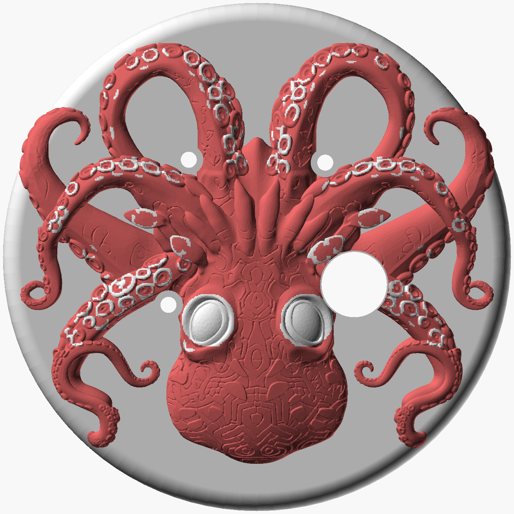

# Kraken Medallion — pendant enclosure (rev v9, resin)

A 70mm disc medallion worn on the chest on a leather cord, hosting the XIAO
ESP32S3 Sense, an LP603449 cell, three INMP441 mics and the camera, under a
bas-relief kraken whose arms wrap the rim.

**v9 is the first revision drawn for resin** — a Creality Halot-Mage 8K in a
rigid photopolymer — and it replaces the single bail with two cord ears.

| | |
|---|---|
| Case | Ø70.0 × 24.6mm (front 6.5 + back 18.1); 63mm across the ears |
| With relief | 29.4mm thick, Ø71.7 across the arm tips |
| Interior | 21.0mm against a 20.2mm stack — +0.8mm, +0.59 at 1% cure shrink |
| Fasteners | 4 × M2×20 button head into **captured M2 nuts**, bolt circle r=30.5 |
| Cord | 3–4mm round leather through two Ø5.5 ears at 45° and 135°, 55mm apart |
| Adhesive | E7000 relief-to-shell; **PSA foam** (3M 467MP) for mic gaskets, not E7000 |
| Wiring | every joint hand-soldered; no pin headers anywhere |



## Files

| File | What it is |
|---|---|
| `pendant_case_v9.scad` | the design of record; `part=` selects `front` / `back` / `kraken` / `assembled` |
| `front_shell.stl` | art-face shell |
| `front_fused.stl` | **front shell + relief as one solid — the recommended resin print** |
| `back_shell.stl` | battery, controls, ears |
| `kraken_wrap_bored.stl` | the relief alone, for a two-part front |
| `kraken_body.stl`, `kraken_accents.stl` | two-material split for an MMU FDM printer; not used on resin |
| `build_kraken.py`, `split_materials.py` | regenerate the relief from the Meshy 3MF, and split it |

```
openscad -o front_shell.stl -D 'part="front"' pendant_case_v9.scad
openscad -o back_shell.stl  -D 'part="back"'  pendant_case_v9.scad
```
`front_fused.stl` is a manifold union of `front_shell.stl` and the relief
sunk 0.25mm into the face (see the commit that added it).

## Printing on the Halot-Mage 8K

Three reviews went into this. The short version:

**Resin.** Use an opaque *tough* / ABS-like resin — elongation ≥15%, notched
Izod ≥40 J/m (Siraya Blu, Formlabs Tough 2000 class). Standard rigid resin at
2–6% elongation snaps an ear on a snatch, and standard grey is translucent at
1.8mm: the RGB LED glows through the top rim and stray light pipes into the
camera cavity. Expect 0.2–0.5% cure shrink. **Don't pre-scale.** Print the
back shell first, measure its OD, and apply one XY factor (≈1.003) to the other
parts. Print both shells in the same orientation so any Z/XY anisotropy ovals
them identically.

**Orientation and supports — the same for all three parts:** tilt 20–25°
about the 90°–270° axis, cavity (or glue face) toward the plate on ≥6mm
supports, exterior up. Nothing touches the art face, the rim fillet the arms
were bent against, the chest face, or the sculpt. Supports land on the cavity
floor, boss and ring tops, the pad and seat faces, and the low rim edge —
0.3mm tips on the front, 0.4 on the back, 0.6 at the low rim edge. The cavity
stays open to the vat so no drain holes are needed. For `front_fused.stl` the
arm tips that curl 1.95mm below the parting plane become small overhangs on
the tilted side; give them light 0.25mm tips. 30–40µm layers for the relief's
sucker texture, 50µm is fine for the back.

**Wash and cure.** Two-stage 95% IPA, 3 min each with agitation, then
compressed air through every port before curing: the 3 × 2.2mm mic ports, the
4 screw bores, both ear holes, the four hex pockets. A cured plug in a 2.2mm
port is a dead mic — verify each with a 2.0mm drill shank. Cure with supports
on, ≤40°C, 2 × 3 min flipped; expect ≤0.2mm bow on the disc. Flat-sand both
rim faces on 320 over glass to remove the low-edge nubs. If the front is two
parts, flat-sand the relief's glue face the same way and clamp it to the shell
for its first cure.

**Why `front_fused.stl`.** On FDM the relief had to be a separate print for
material and support reasons. On resin neither applies, and one solid removes
the glue line, the alignment step, and the 0.3mm bond from the Z stack. Print
it face-up and it needs no support on the sculpt at all.

## What resin changed in the design

| | FDM (v8) | Resin (v9) | Why |
|---|---|---|---|
| Fastening | heat-set brass inserts | captured M2 nuts, hex pocket 4.25 AF × 1.8 | heat-set is a thermoplastic technique; tapping strips in 3–5 reopenings |
| Bolt circle | r=29 | r=30.5 | an Ø8 boss at r=29 bit 0.75mm into a max-envelope cell |
| Hole allowance | +0.6 | +0.25 | resin undersizes ~0.1 from light bleed, not 0.4 |
| Register | 0.8 tongue in a slot, 0.1/side | 1.0 tongue in a rebate, 0.15/side, 0.3×45° lead-in | the slot left a 0.1mm fin the wash snaps off; bleed narrows slots, so *more* clearance |
| Rim controls | cut through a curved 1.8 wall | flat seats: button 15 wide/2.8 thick, USB-C 18/3.2, switch 10/2.6 | a 14.4 nut across an r=33.2 concave wall bears on two edges with 0.75 sagitta — PETG yielded, resin cracks |
| Camera seat | Ø13 around a 9.4 pocket | Ø15 around a 9.0 pocket | the pocket's 6.36 half-diagonal left 0.14mm knife edges at the corners |
| Battery lip | 0.6 wall, 0.6 off-centre | 1.0 wall, centred, notched at the button | 0.6 chips; the offset was a v5 bug; the button body now reaches the lip |
| back_d | 17.8 | 18.1 | 1% shrink on the old 20.7 interior went negative against a ±0.3 stack |
| Chest edge | sharp | r=2.0 round-over | worn against skin daily |
| Screw heads | socket cap, 0.6 proud | ISO 7380 button, 0.2 sub-flush | same reason |

The switch moved 240° → 243° (its nut hit the 225° boss at r=30.5) and its
bore grew 7.0 → 7.2 (zero clearance on an M7 bushing). The USB-C jack now
lies flat rather than on edge, and moved 300° → 295° because the wider cut
then clipped the 315° boss; its flange is **still unmeasured** and its seat
is drawn for 17.5mm — measure before printing.

## The cord ears

Two vertical Ø11 cylinders at r=39, full back-shell height, with a Ø5.5 hole
along the rim tangent so the cord threads along the rim, not front-to-back.
Both mouths are chamfered so the cord bends over an edge. The root is a true
r=3 concave fillet, made in 2D by offsetting the outline out and back in
before extrusion — the earlier hull-to-slab lug left a sharp internal corner
at the rim, which is exactly where a rigid resin starts a crack.

At 45°/135° the holes are 55mm apart (the anti-twist lever), each root sits
over the boss column inside the wall, and the 135° ear's root fillet ends 7°
(4.4mm of rim) clear of the LED window. Sized so the cord is the fuse: 4mm leather breaks at 300–450N; the
ear is good for 600N at ≥3× margin on a 20 MPa notched allowable. Thread from
the top-centre mouth, overhand knot on the outboard mouth — 7mm in 3mm cord,
9mm in 4mm, neither passes 5.5.

## Assembly

1. Wash, post-cure, flat-sand rim faces. Dry-fit tongue to rebate, cell, button, USB-C, switch, LED disc. Drop an M2 nut into each front hex pocket and check it sits below the parting face.
2. If the front is two parts: scuff both bond faces 320–400, IPA wipe, dry 10 min. E7000 relief to shell, a Ø2 pin through the camera bore and one mic bore for alignment, 1kg weight, 24h.
3. Front shell: PSA foam gasket, then mic disc, into each ring. Camera module into the 9.0 seat. Leads 100mm — the shells have to lie open side by side while you solder.
4. Back shell: button (nut on the flat seat), USB-C (two screws), switch, LED disc on its radial pad. 45mm pigtails.
5. Cell: leads soldered with the switch in BAT+, laid in with the leads through the notch, 0.6mm puncture guard on top.
6. Board on the guard, **long axis along X**, centre ≈ (45.4, 38.8). Long axis along Y overlaps mic2's disc by ~5mm; the board's front face sits at z=4.3 and the mic stack tops out at 5.6, so it may not overlap any disc. Solder all tails; fold the stock FPC last.
7. Close: fold front onto back, dress the harness over the bosses and never across the rebate. Four M2×20 finger-tight plus a quarter turn.
8. Cord through each ear, knot outboard, trim. 10kg pull test.
9. Function test. Wear after 72h of E7000 off-gas.

**Most likely first-build failure is step 7:** nine leads plus the FPC in a
0.5mm Z margin with a board nothing locates. A lead pinched across the rebate
stops the tongue seating and the screws crack a boss. Locating features for
the board are an open item.

## Layout

Bosses at 45°/135°/225°/315° on r=30.5, fused 1.3mm into the wall, nearest
opening 13.2mm. Sensors solved against the sculpt's true silhouette with wall
clearance as a hard constraint.

| Opening | Position | Module-to-wall | Sculpt gap |
|---|---|---|---|
| camera | (48.4, 38.8) | 13.26 | bored through |
| mic1 | (22.8, 41.6) | 10.93 | 1.20 |
| mic2 | (44.4, 22.0) | 8.76 | 1.20 |
| mic3 | (25.6, 21.6) | 8.43 | 1.20 |

Mic spread 18.8 / 20.2 / 29.2mm. Controls on the rim: button 270°, USB-C
295°, switch 243°, LED 110°.

The camera looks through the artwork, and that is forced: swept over the whole
board-reach window there is no lens position with 4.5mm of clear sculpt, so a
9.4mm bore 3.27mm deep passes through the relief. With the 1.8mm wall that is a
4.89mm tunnel at 0.54:1 — well clear of vignetting.

## Two colours on a single-material printer

Print the relief in one piece and dry-brush the 107 toroid crests in the shell
colour — dry-brushing catches exactly the raised rims, which is what
`split_materials.py` was tracing. Gluing 100-odd 2mm³ rings is not practical.
For the eyes, paint them, or print the two Ø7 eye domes from
`kraken_accents.stl` in a second resin with −0.1mm XY compensation in the
slicer and resin-weld them into the sockets.

## Still needs a bench measurement

- USB-C panel-mount flange dimensions and body length behind the flange — the seat is drawn for 17.5 wide
- charge current
- OV2640 vs OV3660
- whether the LP603449's 51mm includes the folded protection PCB (body is 49)
- charge gating: the XIAO's BQ25101 has no NTC; the cell sits at 45–50°C worst case against the back wall. Gate charging on the S3's die temperature in firmware.

## Notes on the mesh

`kraken_wrap_bored.stl` is closed (0 boundary edges) with a single non-manifold
edge where two parts of the sculpt touch. manifold3d accepts it and slicers
handle it; check the slice preview at that layer. `front_fused.stl` inherits
it.
