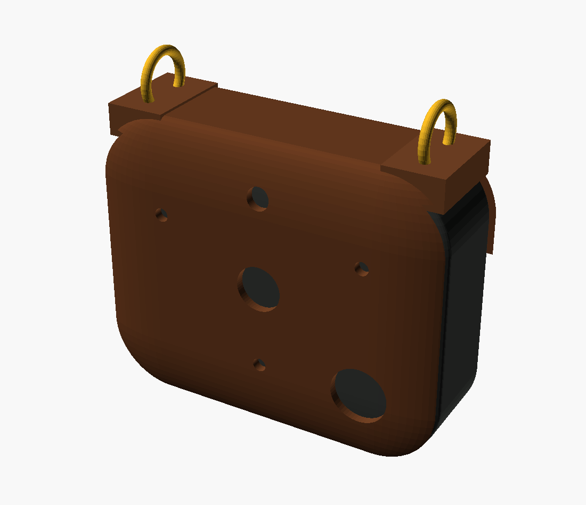
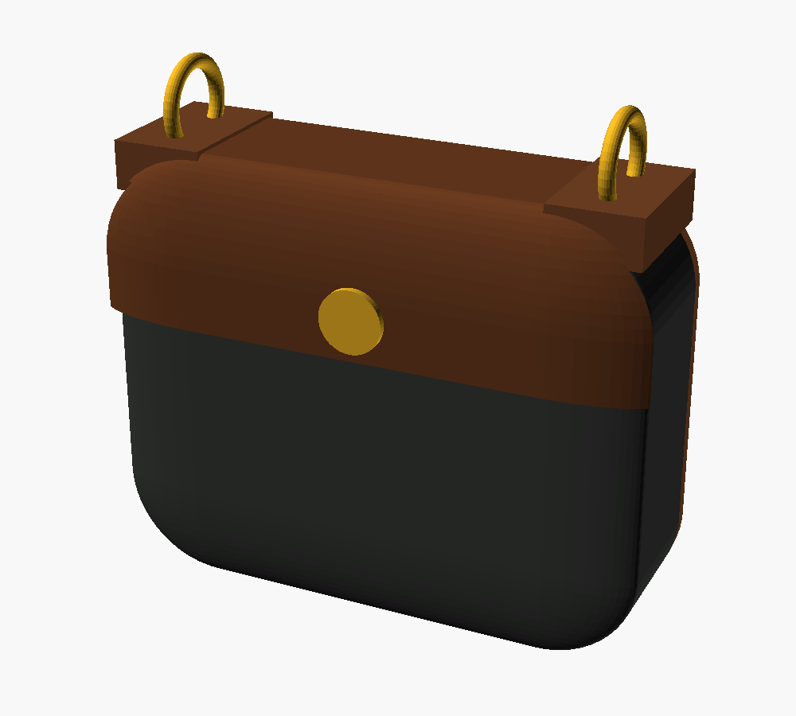

# Pouch Mk1

A leather-faced chest pouch, sewn on a Singer CG590. Rigid where parts inset,
soft where it meets you.



| | |
|---|---|
| Finished | 78 × 62 × 24 mm |
| Cavity | 64 × 48 × 22 mm, against a 20.2 mm stack |
| Flat area | 291 cm² per unit, before the strap |
| First unit | ≈ 3 h |

## Files

| File | What |
|---|---|
| `pattern.py` | Generates everything below. Edit here, not in the SVGs. |
| `sheet1.svg`, `sheet2.svg` | 1:1 cutting sheets. **Print at 100%, not "fit to page."** |
| `template.dxf` | Front-panel outline + aperture centres, for the laser-cut acrylic template |
| `pouch_mk1.scad` | Assembled visualisation — not a printable part |

```
python3 pattern.py
openscad -o renders/pouch_iso.png --preview -D 'part="pouch"' pouch_mk1.scad
```

Each sheet carries a **50 mm calibration square**. Measure it before you cut
anything; printer scaling is the usual reason a first pattern comes out
wrong, and leather does not forgive a re-cut.

## Construction

Bound-edge, three panels. **Every piece is cut to finished size — there is no
seam allowance anywhere.** Adding one is how you end up with a pouch 6 mm too
big in every direction.

- **Front + flap, one piece** of veg-tan 4–5 oz, 78 × 114. No seam at the
  fold, so the flap keeps its spring.
- **Back and gusset** in soft laminate. It eases round the R14 corners
  without notching, pads the cell, and it is what touches you.
- **Gusset run is 190 mm** — the front panel's perimeter *minus* its top
  edge, since the top is the opening. Cut 205 and trim at assembly.



## Aperture layout

Panel coordinates, millimetres from the front panel's bottom-left corner:

| | x | y | ⌀ |
|---|---|---|---|
| mic A | 16 | 44 | 3.0 |
| mic B | 62 | 44 | 3.0 |
| mic C | 39 | 15 | 3.0 |
| camera | 39 | 33 | 10.0 |
| LED | 39 | 53 | 5.0 |
| button | 62 | 15 | 12.5 |
| snap, cap half | 39 | 102 | 4.0 |

A, B and C are the firmware's names (`firmware/src/config.h`: A and C tie L/R to GND, B to 3V3). The mics move relative to the medallion, deliberately. There the sculpt
squeezed them to 18.8 / 20.2 / 29.2 mm; a blank panel has no artwork to dodge,
so this opens them to **46 / 37 / 37 mm**. Wider spacing gives a bigger level
difference between your own voice and everyone else's, which is what the
own-voice gate keys on. Nothing in the firmware assumes the old geometry.

No USB-C or switch aperture in Mk1 — open the flap to charge. Every hole
through leather is a sweat path and a stress riser, and a port you touch once
a day does not earn one.

## Three things that decide whether this works

1. **Nothing soft over a mic port.** Fabric moving across a port is louder
   than the conversation. Bond the mesh all the way round; a mesh that can
   lift is a mesh that rustles.
2. **No hook-and-loop.** Ripping Velcro 100 mm from three mics is a loud
   transient every time you open it, and it sheds lint into the ports.
   Line 24 snaps instead.
3. **Fit a breakaway clasp.** A closed loop round the neck on something worn
   daily — driving, sleeping, near a moving spindle — is a snag hazard. It is
   why industrial ID lanyards all have one.

Materials, thread and needle specs, and the full stitch order are in the
build sheet. Machine settings in brief: bonded polyester Tex 70 (V-69),
leather-point 110/18 for the veg-tan and stretch 90/14 for the laminate,
3.2 mm stitch, Teflon or roller foot, glue-baste every seam because you
cannot pin leather, and no backstitching — long tails, tied and melted.

## Mk2

Cut a ⌀72 mm window in the front panel and let the printed front shell drop
in as a faceplate, retained by a stitched ring 6 mm outboard. The panel grows
to about 94 × 94 mm. That gets the mics gasketed to rigid plastic and stops
the array geometry flexing — see [`../README.md`](../README.md) for why that
matters more than it sounds.
